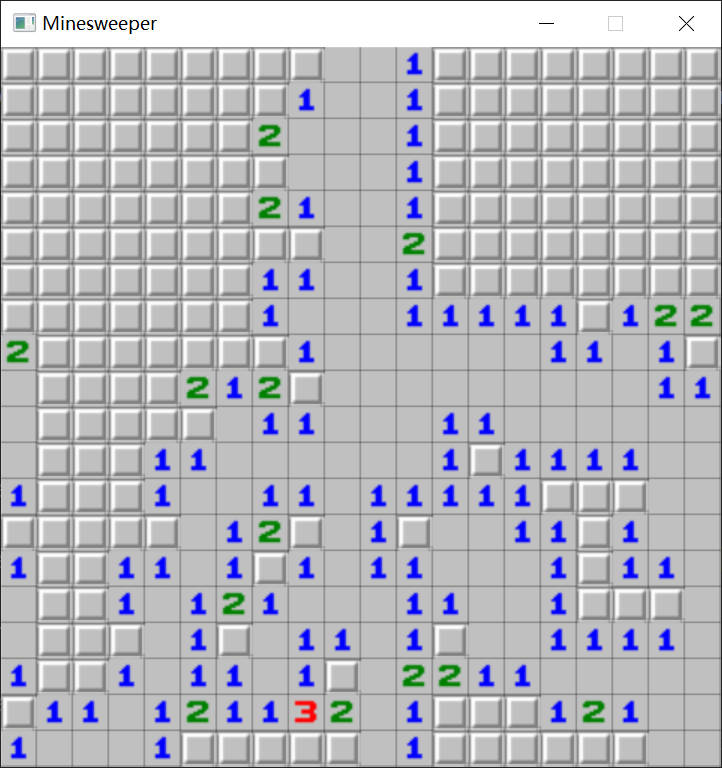

# 💣 简易实现扫雷

这是一个基于 EasyX 实现的简易版扫雷游戏，是帮同学临时写的 C 语言结课作业，目前可能有点 BUG，以后心情好了再去好好实现一下吧！

# 🎏 学习心得

该程序让我深入理解了第三方库的含义，虽然只是源文件引入，不涉及**动态库**、**静态库**，但是谁不是从简单开始的呢？

同时，他也让我理解了 include 的具体含义，以及符号 `<>` 与 `""` 索引头文件区别。

- `<>`：引入标准库环境的头文件。
- `""`：引入相对于开发环境的头文件，如果找不到就去标准库环境寻找。

# ✨ 程序运行截图

